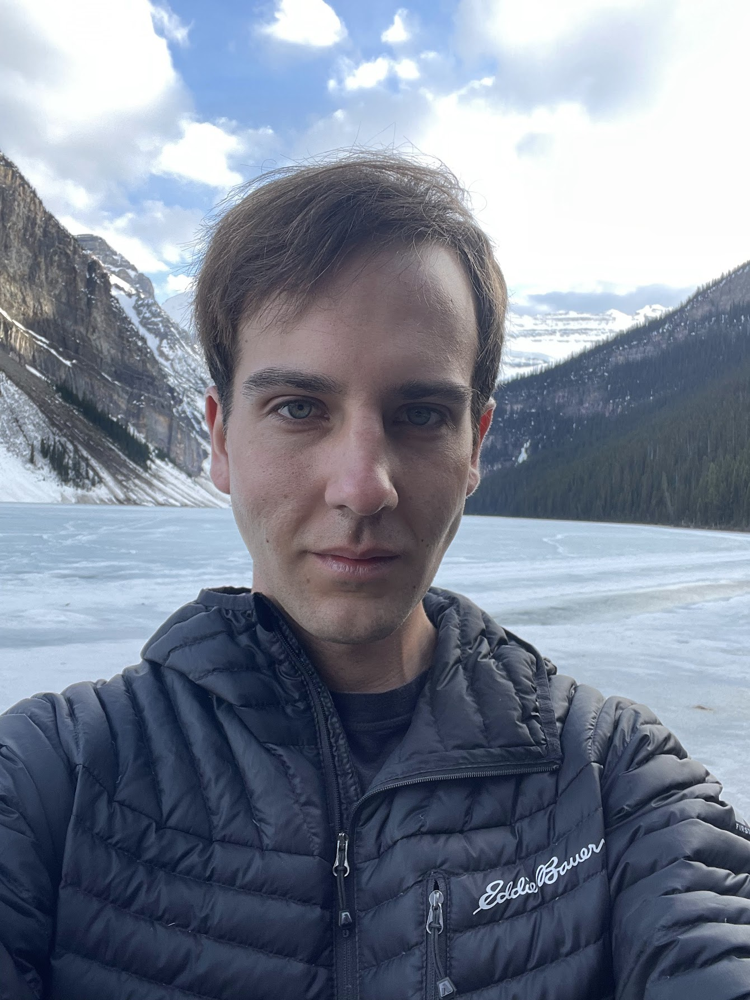

## About

David Venuto is a machine learning researcher and PhD student at Mila and McGill University under the supervision of Doina Precup.  

For code related to research see: [GitHub](https://github.com/dvVenuto).

## Research Interest

David is mainly interested in reinforcement learning (RL). More specifically, he focuses on hierarchical RL and inverse RL using options. Currently, he is focusing on the consciousness prior in RL to better understand top down problem solving and out of distribution generalization.

## Publications 

David Venuto's latest publications can be found on [Google Scholar](https://scholar.google.ca/citations?user=32rbUtYAAAAJ&hl=en).

